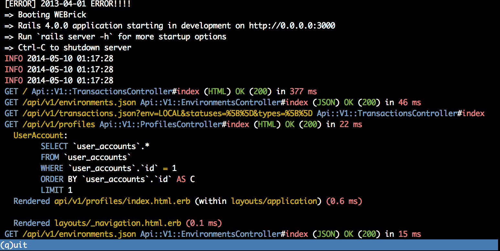

# LogV Alpha
Developer tool for better real-time log visualization.



**Note**: currently only *Rails* logs are supported. But you're welcome
to contribute a parser for your framework.

## Features:

- Transforms all log records to Javascript objects, which allows you to
  - Include/exclude them based on attributes (TBD)
  - query them (TBD)
- Scopes
  - All logging for a single request can be rendered as 1 expandable line
- Custom highlighting of log records (like SQL, JSON, XML, stacktraces)
- Extendable - you can create a parser for your own log format
- Can run on your server/development machine
- Piping - just do
```sh
  rails s | logv
```
...and enjoy
